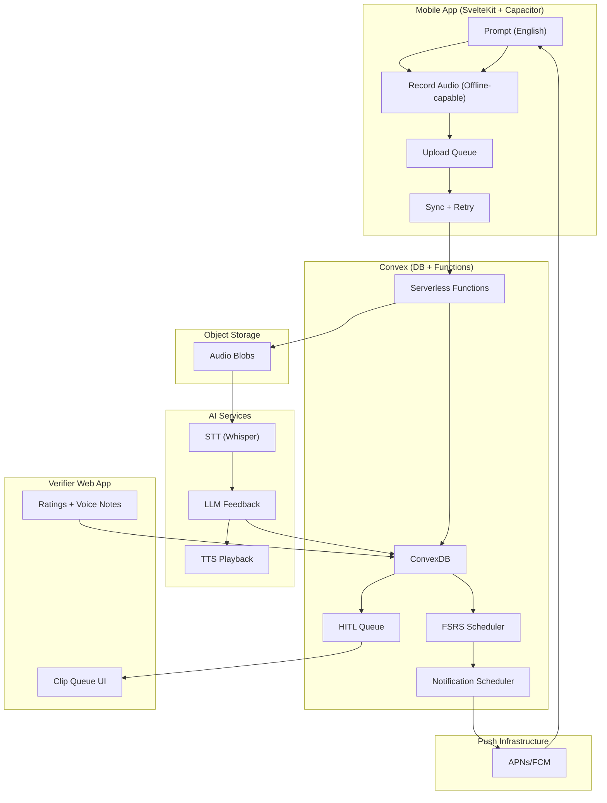

# Architecture Gap Map: Xhosa Language Production App

Date: 2026-02-04
Branch: codex/extended-architecture

This document maps the current codebase to the target architecture described in the Technical Architecture Brief, and proposes a pragmatic phased plan to reach it.

## Part A: Gap Map (Requirement vs Current State)

### 1) Learning Loop (Audio-First Production)
- Target: English prompt -> user speaks Xhosa -> AI feedback -> (Pro) HITL feedback -> FSRS update.
- Current: English prompt -> user types translation -> correctness shown by string comparison.
- Status: Missing core audio-first loop.
- Impact: The system currently optimizes recognition/typing, not spoken production.
- Files: src/routes/practice/+page.svelte

### 2) Audio Recording Pipeline
- Target: Offline-capable audio capture, compression, upload, retry, storage.
- Current: No audio capture or upload.
- Status: Not implemented.

### 3) AI Feedback Pipeline
- Target: STT (Whisper), phoneme/click detection, error analysis, feedback text + optional TTS.
- Current: Google Translate text similarity used for verification of typed translation.
- Status: Not implemented; current logic is misaligned with spoken production goals.
- Files: convex/translateNode.ts, src/routes/session/[id]/+page.svelte

### 4) Human-in-the-Loop (HITL) Verification
- Target: Verifier queue, rating (correct/almost/wrong), optional voice note corrections, trust scoring.
- Current: No verifier system.
- Status: Not implemented.

### 5) Spaced Repetition (FSRS)
- Target: Per-user, per-phrase FSRS state and scheduling.
- Current: Randomized push notifications per phrase, no per-item difficulty/stability tracking.
- Status: Not implemented; current scheduling is not FSRS.
- Files: convex/notifications.ts, convex/schema.ts

### 6) Notification Engine
- Target: Notification as learning event, includes English prompt, randomized within active window, reschedules dismissed items via FSRS.
- Current: Web push notifications with English prompt, quiet hours respected, random times for next 24h.
- Status: Partially aligned. Lacks FSRS integration, dismissal tracking, and mobile-native support.
- Files: convex/notifications.ts, convex/notificationsNode.ts, docs/PUSH_NOTIFICATIONS_SETUP.md

### 7) Content Model (Xhosa-Specific)
- Target: Phrase attributes include grammar tags, phonetic tags (clicks), domain/context tags, difficulty, reference audio.
- Current: Phrase has only English + translation + sessionId + createdAt.
- Status: Not implemented.
- Files: convex/schema.ts, convex/phrases.ts

### 8) User State Management
- Target: Per-phrase attempt history, audio, scores; per-user proficiency; daily minutes quota tracking.
- Current: Sessions + phrases only, no attempt history or per-user proficiency.
- Status: Not implemented.

### 9) Offline-First Requirements
- Target: Offline prompts and recording; upload queue; conflict handling; sync on reconnect.
- Current: Web push only; no offline queue.
- Status: Not implemented.

### 10) Tiering + Billing
- Target: AI vs Pro tiers, daily minutes caps, upgrade flow, billing provider integration.
- Current: No billing system or tier enforcement.
- Status: Not implemented.

### 11) Analytics + Data Flywheel
- Target: Attempt telemetry, HITL labels, anonymized corpus, export pipeline, consent flows.
- Current: No analytics pipeline beyond Convex data.
- Status: Not implemented.

### 12) Verifier Operations
- Target: Onboarding, QA, trust scores, payments, capacity tracking.
- Current: Not present.
- Status: Not implemented.

## Part B: What Already Resonates

1) Recall-first prompting exists (English prompt shown before answer).
- File: src/routes/practice/+page.svelte

2) Notification delivery includes English prompt and respects quiet hours.
- Files: convex/notifications.ts, convex/notificationsNode.ts

3) User preference storage for quiet hours and notification frequency.
- File: convex/schema.ts

4) Phrase-centered learning model (phrases stored, not single words).
- Files: convex/schema.ts, convex/phrases.ts

## Part C: Phased Build Plan

This plan prioritizes shipping the audio-first loop quickly, then layering FSRS, HITL, and data flywheel.

### Phase 1: Audio-First MVP (2–4 weeks)
Goal: Ship core spoken production loop with AI-only feedback.

- Data model
  - Add tables: attempts, ai_feedback, user_phrases (FSRS stub), audio_assets
  - Extend phrases with Xhosa-specific tags and reference audio URL
- Client
  - Audio recording UI (record, replay, submit)
  - Upload queue with retry
  - Feedback screen (AI feedback only)
- Backend
  - Upload endpoint (signed URL or Convex storage abstraction)
  - STT integration (Whisper API) and basic scoring
  - AI feedback generation (LLM)
- Notifications
  - Keep existing randomized notifications, but include phraseId and English prompt

Exit criteria:
- A user can record, upload, receive AI feedback, and repeat daily.

### Phase 2: FSRS + Scheduling (2–3 weeks)
Goal: Replace random scheduling with FSRS and integrate review outcomes.

- Add FSRS state to user_phrases
- Implement FSRS scheduler and update per review
- Notification scheduling pulls from FSRS nextReviewAt
- Track dismissals and reschedule via FSRS logic

Exit criteria:
- Next review times reflect user performance.

### Phase 3: Pro Tier + HITL (3–5 weeks)
Goal: Add verifier system and tiered value.

- Verifier web app with clip queue and one-tap rating
- HITL tables: hitl_reviews, verifier_profiles, verifier_stats
- Async feedback delivery to users
- Add Pro tier gating and daily minute limits
- Add trust scoring using seeded clips

Exit criteria:
- Pro users receive human feedback within 24 hours.

### Phase 4: Offline-First + Mobile Native (3–5 weeks)
Goal: Make recording and prompts robust under intermittent connectivity.

- Offline queue for audio, attempts, and review state
- Sync engine with conflict resolution
- Push notification integration for iOS/Android (FCM/APNs)

Exit criteria:
- User can record offline and sync later without data loss.

### Phase 5: Data Flywheel + Analytics (ongoing)
Goal: Capture and monetize the corpus.

- Consent capture and anonymization pipeline
- Data export tooling for model training
- AI/HITL agreement tracking
- Automated model re-training loop and routing by confidence

Exit criteria:
- Continuous improvement loop reduces HITL costs.

## Part D: Immediate Next Actions (if we continue)

1) Confirm desired target stack for mobile (Capacitor vs React Native).
2) Extend Convex schema with attempts, feedback, and audio storage.
3) Implement audio capture UI in practice flow.
4) Define provider abstraction interfaces (STT, LLM, TTS).

## Part E: One-Page Architecture Diagram

